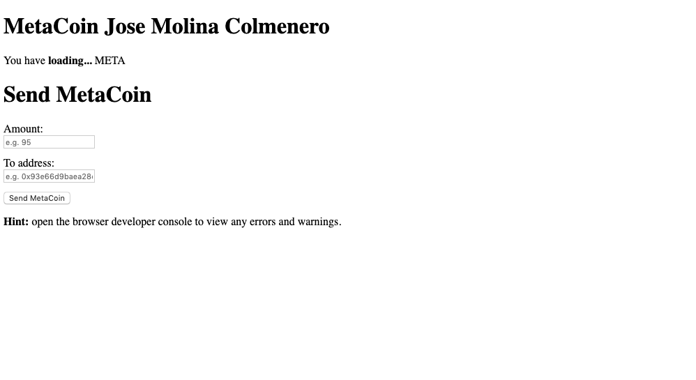

# Ejercicio 2 - IPFS (3 puntos)

> A partir de un truffle project como puede ser la pet-shop utilizada en bloques anteriores.
>
> *También puede utilizar otro truffle project.
>
> Haga una pequeña modificación en su frontend para mostrar su nombre al ejecutar la
> aplicación. (Puede editar cualquier parámetro adicional, siempre y cuando el nombre sea
> visible).
>
> Suba el truffle project a GitHub manteniendo su estructura. (No incluya la carpeta
> node_modules).
>
> Arranque un daemon de IPFS y aloje la DApp (Proyecto truffle elegido).
>
> Una vez alojada la DApp, debe ser capaz de utilizar la aplicación al igual que en localhost,
> es decir, firmando transacciones mediante MetaMask.
>
> Describa todo el procedimiento adjuntando las instrucciones utilizadas y sus outputs,
> además adjunte el hash de IPFS. Se recomienda realizar la carga (o recarga si ya ha
> realizado la carga en IPFS) en una fecha cercana a la entrega. Esto es debido a que si
> realiza la carga en una fecha temprana, puede que el contenido tarde o no llegue incluso
> a cargar. También debe indicar si los contratos están desplegados en Ganache o
> Rinkeby.
>
> *Se recomienda alojar el contenido a subir en IPFS en una única carpeta, ésta también
> debe alojarse en GitHub.


En primer lugar procedemos a instanciar el proyecto de webpack:

```
$ mkdir webpack
$ cd webpack
$ truffle unbox webpack
  ``
  
✔ Preparing to download
✔ Downloading
✔ Cleaning up temporary files
✔ Setting up box

Unbox successful. Sweet!

Commands:

Compile:              truffle compile
Migrate:              truffle migrate
Test contracts:       truffle test
Run dev server:       cd app && npm run dev
Build for production: cd app && npm run build
```

Seguidamente vamos a modificar el archivo ``index.html`` para incluir los cambios pertinentes.
Los resultados se pueden ver en la siguiente imagen:



A continuación vamos a desplegar los contratos en la red Rinkeby para poder usarlos en la web:

```
$ truffle compile

Compiling your contracts...
===========================
> Compiling ./contracts/ConvertLib.sol
> Compiling ./contracts/MetaCoin.sol
> Compiling ./contracts/Migrations.sol
> Artifacts written to /Users/molina/workspace/uah/test-ehtereum-2/ejercicio2/webpack/build/contracts
> Compiled successfully using:
   - solc: 0.5.8+commit.23d335f2.Emscripten.clang
```

```
$ truffle migrate


Compiling your contracts...
===========================
> Everything is up to date, there is nothing to compile.


Migrations dry-run (simulation)
===============================
> Network name:    'development-fork'
> Network id:      4
> Block gas limit: 0x6ad4c7


1_initial_migration.js
======================

   Deploying 'Migrations'
   ----------------------
   > block number:        4658044
   > block timestamp:     1562000446
   > account:             0x5531D7617F2Ea28BE9dE4e8fB74702b8a8259F22
   > balance:             0.982008676
   > gas used:            246393
   > gas price:           2 gwei
   > value sent:          0 ETH
   > total cost:          0.000492786 ETH

   -------------------------------------
   > Total cost:         0.000492786 ETH


2_deploy_contracts.js
=====================

   Deploying 'ConvertLib'
   ----------------------
   > block number:        4658046
   > block timestamp:     1562000446
   > account:             0x5531D7617F2Ea28BE9dE4e8fB74702b8a8259F22
   > balance:             0.981747384
   > gas used:            103623
   > gas price:           2 gwei
   > value sent:          0 ETH
   > total cost:          0.000207246 ETH


   Linking
   -------
   * Contract: MetaCoin <--> Library: ConvertLib

   Deploying 'MetaCoin'
   --------------------
   > block number:        4658047
   > block timestamp:     1562000446
   > account:             0x5531D7617F2Ea28BE9dE4e8fB74702b8a8259F22
   > balance:             0.981100686
   > gas used:            323349
   > gas price:           2 gwei
   > value sent:          0 ETH
   > total cost:          0.000646698 ETH

   -------------------------------------
   > Total cost:         0.000853944 ETH


Summary
=======
> Total deployments:   3
> Final cost:          0.00134673 ETH


Starting migrations...
======================
> Network name:    'development'
> Network id:      4
> Block gas limit: 0x6ad4c7


1_initial_migration.js
======================

   Deploying 'Migrations'
   ----------------------
   > transaction hash:    0x5c1365d5ecbddb29a236ed9127ede74d4fd723fea59f111ca63f0f148d6b5f07
   > Blocks: 2            Seconds: 24
   > contract address:    0xcE0fb50396FD40EA32d90E0a35Cca1950Bc0F24A
   > block number:        4658044
   > block timestamp:     1562000467
   > account:             0x5531D7617F2Ea28BE9dE4e8fB74702b8a8259F22
   > balance:             0.977273602
   > gas used:            261393
   > gas price:           20 gwei
   > value sent:          0 ETH
   > total cost:          0.00522786 ETH


   > Saving migration to chain.
   > Saving artifacts
   -------------------------------------
   > Total cost:          0.00522786 ETH


2_deploy_contracts.js
=====================

   Deploying 'ConvertLib'
   ----------------------
   > transaction hash:    0x358009dfbad20d1d9c126c7947071c53b7e28e2d28c3932feedda3d991bd5cf2
   > Blocks: 1            Seconds: 12
   > contract address:    0x8A46E57FE68Ba5B2c4f41046bEF455600Ffc15C7
   > block number:        4658046
   > block timestamp:     1562000497
   > account:             0x5531D7617F2Ea28BE9dE4e8fB74702b8a8259F22
   > balance:             0.974360682
   > gas used:            103623
   > gas price:           20 gwei
   > value sent:          0 ETH
   > total cost:          0.00207246 ETH


   Linking
   -------
   * Contract: MetaCoin <--> Library: ConvertLib (at address: 0x8A46E57FE68Ba5B2c4f41046bEF455600Ffc15C7)

   Deploying 'MetaCoin'
   --------------------
   > transaction hash:    0x67bc89d519c5232c1b2099baf940ef887868d4414e29eee0532ac5d1374b259d
   > Blocks: 2            Seconds: 44
   > contract address:    0xDD66A54c0D528384A41F9abD5417c7dFebED5D86
   > block number:        4658049
   > block timestamp:     1562000542
   > account:             0x5531D7617F2Ea28BE9dE4e8fB74702b8a8259F22
   > balance:             0.967593702
   > gas used:            338349
   > gas price:           20 gwei
   > value sent:          0 ETH
   > total cost:          0.00676698 ETH


   > Saving migration to chain.
   > Saving artifacts
   -------------------------------------
   > Total cost:          0.00883944 ETH


Summary
=======
> Total deployments:   3
> Final cost:          0.0140673 ETH
```

Una vez migrados los contratos procedemos a crear la carpeta ``dist/`` con el empaquetado de la app:

```
$ npm run build

> app@1.0.0 build /Users/molina/workspace/uah/test-ehtereum-2/ejercicio2/webpack/app
> webpack

Hash: 7b1e581738a1bf676140
Version: webpack 4.28.1
Time: 1308ms
Built at: 07/01/2019 7:03:35 PM
     Asset       Size  Chunks             Chunk Names
index.html  879 bytes          [emitted]
  index.js   2.02 MiB    main  [emitted]  main
Entrypoint main = index.js
[0] util (ignored) 15 bytes {main} [built]
[1] util (ignored) 15 bytes {main} [built]
[2] buffer (ignored) 15 bytes {main} [optional] [built]
[3] crypto (ignored) 15 bytes {main} [optional] [built]
[../build/contracts/MetaCoin.json] 99.4 KiB {main} [built]
[./node_modules/webpack/buildin/global.js] (webpack)/buildin/global.js 472 bytes {main} [built]
[./node_modules/webpack/buildin/module.js] (webpack)/buildin/module.js 497 bytes {main} [built]
[./src/index.js] 2.08 KiB {main} [built]
    + 283 hidden modules
```


A continuación vamos a arrancar el proceso en segundo plano de IPFS:

```
$ ipfs daemon
Initializing daemon...
go-ipfs version: 0.4.18-
Repo version: 7
System version: amd64/darwin
Golang version: go1.11.1
Swarm listening on /ip4/127.0.0.1/tcp/4001
Swarm listening on /ip4/192.168.1.128/tcp/4001
Swarm listening on /ip6/::1/tcp/4001
Swarm listening on /p2p-circuit
Swarm announcing /ip4/127.0.0.1/tcp/4001
Swarm announcing /ip4/192.168.1.128/tcp/4001
Swarm announcing /ip6/::1/tcp/4001
API server listening on /ip4/127.0.0.1/tcp/5001
Gateway (readonly) server listening on /ip4/127.0.0.1/tcp/8080
Daemon is ready
```

Una vez arrancado podemos añadir la carpeta de ``dist/`` previamente creada a IPFS:

```
$ cd app
$ ipfs add -r dist/
added QmcrWVNs2QqVEX8pUUVWafxoVv5AHNAYJ11XQcnGBPQz2K dist/index.html
added QmWwrUva2Ur3LgRNfxBEvDjUTchhv8Vw98QvqVZuVANwXt dist/index.js
added QmaWNyVhMud9XcMbesBsJvzoFZG9zMHqkXzuxV4uG7Ux6B dist
 2.02 MiB / 2.02 MiB [===============================================================================] 100.00%
```

Una vez finalizado el proceso podemos ver que el hash que contiene todos los archivos es
``QmaWNyVhMud9XcMbesBsJvzoFZG9zMHqkXzuxV4uG7Ux6B``, y por tanto podemos acceder a 
http://127.0.0.1:8080/ipfs/QmaWNyVhMud9XcMbesBsJvzoFZG9zMHqkXzuxV4uG7Ux6B/ e interactuar con la aplicación usando directamente
la red Rinkeby.


