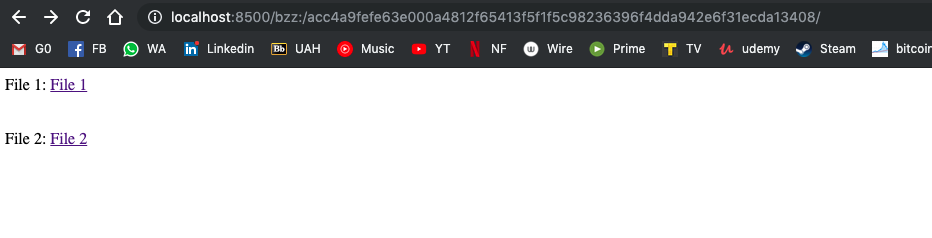
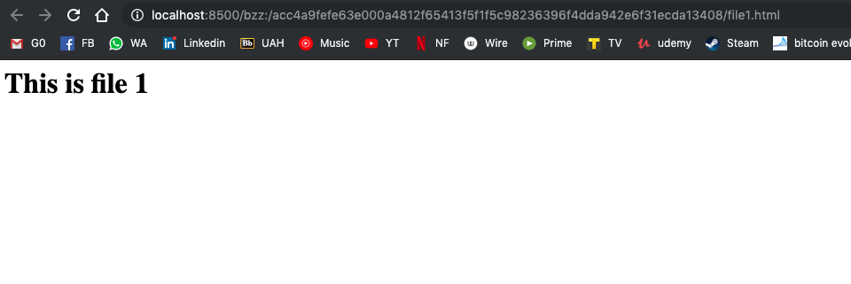
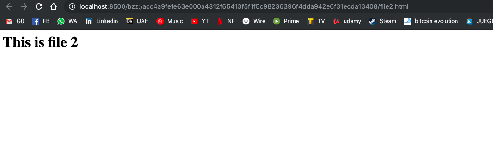

# Ejercicio 3 - SWARM (2 puntos)

> Cree una página web básica (archivo HTML) en la cual se muestren los vínculos a dos
> archivos distintos alojados en Swarm además de su nombre.
>
> En la subida de los archivos debe utilizar el cifrado disponible en Swarm.
>
> No se considerará válido si se suben los contenidos por separado y se vinculan en el
> archivo HTML posteriormente. Al navegar entre los archivos, el hash de Swarm mostrado
> en la barra de direcciones no debe cambiar.
>
> No es necesario vincular el hash de Swarm a ENS.

En primer lugar vamos a iniciar Swarm. Para ello seguiremos los siguientes pasos:

* Crear una nueva cuenta en geth:

```
$ geth account new
Your new account is locked with a password. Please give a password. Do not forget this password.
Passphrase:
Repeat passphrase:
Address: {563354eeb6e83f31e09b8d571facf4da205844bb}
```

*  Iniciar swarm con dicha cuenta:

```
$ swarm -bzzaccount 5531d7617f2ea28be9de4e8fb74702b8a8259f22

Unlocking swarm account 0x563354eEB6E83F31E09b8d571FaCF4dA205844bB [1/3]
Passphrase:
INFO [07-01|19:50:03.029] Starting peer-to-peer node               instance=swarm/v0.4.3/darwin-amd64/go1.12.6
INFO [07-01|19:50:03.231] New local node record                    seq=1 id=ed4ccd721cc1e6ae ip=127.0.0.1 udp=30399 tcp=30399
INFO [07-01|19:50:03.231] Updated bzz local addr                   oaddr=53f62bd84a9b94437126014d4cce02f27e264d77deb3032f40c4c50357efd034 uaddr=enode://1e39d599ba3e3d529f069949074f009285dfbba97fdb65f1b42fe34e7a17ff8eabfc47830235d754471fecc5005c31c8e18beca49f30b5348c128b1842338186@127.0.0.1:30399
INFO [07-01|19:50:03.231] Started P2P networking                   self=enode://1e39d599ba3e3d529f069949074f009285dfbba97fdb65f1b42fe34e7a17ff8eabfc47830235d754471fecc5005c31c8e18beca49f30b5348c128b1842338186@127.0.0.1:30399
INFO [07-01|19:50:03.231] Starting bzz service
INFO [07-01|19:50:03.231] Starting hive                            baseaddr=53f62bd8
INFO [07-01|19:50:03.231] Detected an existing store. trying to load peers
INFO [07-01|19:50:03.232] hive 53f62bd8: no persisted peers found
INFO [07-01|19:50:03.232] Swarm network started                    bzzaddr=53f62bd84a9b94437126014d4cce02f27e264d77deb3032f40c4c50357efd034
INFO [07-01|19:50:03.232] Started Pss
INFO [07-01|19:50:03.232] Loaded EC keys                           pubkey=0x04b844db7b6b9afc2aee4d936de0b5db38d2776bd528de94d298202a46082854b63a09c32181cb017b6c0b3d8d1be4647ba755fbe9f566ff436b44a3e463d47e30 secp256=0x02b844db7b6b9afc2aee4d936de0b5db38d2776bd528de94d298202a46082854b6
INFO [07-01|19:50:03.232] Streamer started
INFO [07-01|19:50:03.235] IPC endpoint opened                      url=/Users/molina/Library/Ethereum/bzzd.ipc
INFO [07-01|19:50:05.519] New local node record                    seq=2 id=ed4ccd721cc1e6ae ip=37.11.209.147 udp=30399 tcp=30399
```

* Subir los [archivos](./files) a swarm:

```
$ swarm --defaultpath files/index.html --recursive up files
acc4a9fefe63e000a4812f65413f5f1f5c98236396f4dda942e6f31ecda13408
```

* Usar el navegador para ver el contenido del archivo:




* Clicar en ambos enlaces y comprobar que funcionan:



