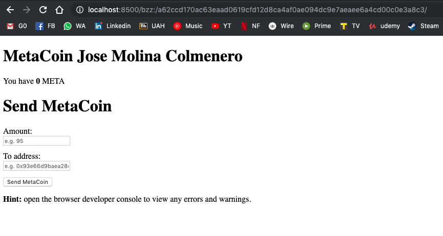
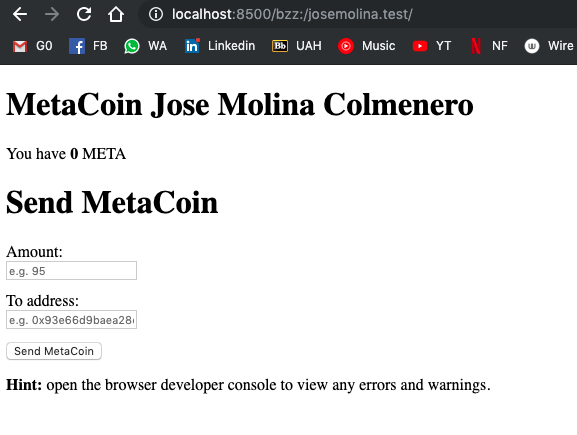

# Ejercicio 4 - SWARM (4 puntos)

> Puede reutilizar parte de lo que ha realizado en el ejercicio 2 (hasta subir el proyecto a
> GitHub).
>
> Arranque un nodo de Swarm y aloje la DApp (Proyecto truffle elegido).
>
> Además, vincule el ENS adquirido en el ejercicio 1 con la DApp, de tal forma que una url
> como la de a continuación muestre la aplicación. Por ejemplo:
>
> http://localhost:8500/bzz:/swarmtest.test/index.html
>
> Una vez alojada la DApp, debe ser capaz de utilizar la aplicación al igual que en localhost,
> es decir, firmando transacciones mediante MetaMask.
>
> Adjunte el hash de Swarm asociado con la aplicación.
>
> Describa todo el procedimiento adjuntando las instrucciones utilizadas y sus outputs.
> Adjunte todos los pantallazos que considere relevantes (como puede ser el navegador
> mostrando la aplicación o transacciones de MetaMask, entre otros) e indique las
> direcciones de los contratos en la red correspondiente (Rinkeby, Ropsten…).


Primeramente vamos a cargar tanto geth como Swarm:

```
$ geth --rpcapi eth,web3,personal,db,net --rpc --rinkeby --ipcpath "/Users/molina/Desktop/geth.ipc"
INFO [07-01|23:58:03.191] Maximum peer count                       ETH=25 LES=0 total=25
INFO [07-01|23:58:03.217] Starting peer-to-peer node               instance=Geth/v1.8.27-stable/darwin-amd64/go1.12.4
INFO [07-01|23:58:03.217] Allocated cache and file handles         database=/Users/molina/Library/Ethereum/rinkeby/geth/chaindata cache=512 handles=5120
INFO [07-01|23:58:05.803] Persisted trie from memory database      nodes=355 size=51.91kB time=719.254µs gcnodes=0 gcsize=0.00B gctime=0s livenodes=1 livesize=0.00B
INFO [07-01|23:58:05.804] Initialised chain configuration          config="{ChainID: 4 Homestead: 1 DAO: <nil> DAOSupport: true EIP150: 2 EIP155: 3 EIP158: 3 Byzantium: 1035301 Constantinople: 3660663  ConstantinopleFix: 4321234 Engine: clique}"
INFO [07-01|23:58:05.804] Initialising Ethereum protocol           versions="[63 62]" network=4
INFO [07-01|23:58:05.818] Loaded most recent local header          number=4659229 hash=80f044…a43e61 td=8529823 age=43s
INFO [07-01|23:58:05.818] Loaded most recent local full block      number=4659229 hash=80f044…a43e61 td=8529823 age=43s
INFO [07-01|23:58:05.818] Loaded most recent local fast block      number=4659229 hash=80f044…a43e61 td=8529823 age=43s
INFO [07-01|23:58:05.822] Loaded local transaction journal         transactions=2 dropped=2
INFO [07-01|23:58:05.823] Regenerated local transaction journal    transactions=0 accounts=0
WARN [07-01|23:58:05.823] Blockchain not empty, fast sync disabled
INFO [07-01|23:58:05.932] New local node record                    seq=32 id=5f731a2d8bca106c ip=127.0.0.1 udp=30303 tcp=30303
INFO [07-01|23:58:05.932] Started P2P networking                   self=enode://a63816ba56dd71e52c331e589d66530b06cabeee417f5a6fd3f83b6cf9258f1cb3e49fd6e8c1ec1b4cc7e74dde3c02f17a756f196a0e286349388b2d677d22ea@127.0.0.1:30303
INFO [07-01|23:58:05.935] IPC endpoint opened                      url=/Users/molina/Desktop/geth.ipc
INFO [07-01|23:58:05.935] HTTP endpoint opened                     url=http://127.0.0.1:8545          cors= vhosts=localhost
INFO [07-01|23:58:09.938] New local node record                    seq=33 id=5f731a2d8bca106c ip=37.11.209.147 udp=30303 tcp=30303
INFO [07-01|23:58:35.933] Block synchronisation started

...
```

```
$ swarm --ens-api 'test:0xe7410170f87102df0055eb195163a03b7f2bff4a@/Users/molina/Desktop/geth.ipc' --bzzaccount 563354eeb6e83f31e09b8d571facf4da205844bb
INFO [07-01|23:59:57.290] Maximum peer count                       ETH=50 LES=0 total=50
Unlocking swarm account 0x563354eEB6E83F31E09b8d571FaCF4dA205844bB [1/3]
Passphrase:
INFO [07-01|23:59:59.275] Starting peer-to-peer node               instance=swarm/v0.4.3/darwin-amd64/go1.12.6
INFO [07-01|23:59:59.343] connecting to ENS API                    url=/Users/molina/Desktop/geth.ipc
INFO [07-01|23:59:59.618] New local node record                    seq=9 id=ed4ccd721cc1e6ae ip=127.0.0.1 udp=30399 tcp=30399
INFO [07-01|23:59:59.618] Updated bzz local addr                   oaddr=53f62bd84a9b94437126014d4cce02f27e264d77deb3032f40c4c50357efd034 uaddr=enode://1e39d599ba3e3d529f069949074f009285dfbba97fdb65f1b42fe34e7a17ff8eabfc47830235d754471fecc5005c31c8e18beca49f30b5348c128b1842338186@127.0.0.1:30399
INFO [07-01|23:59:59.618] Starting bzz service
INFO [07-01|23:59:59.618] Started P2P networking                   self=enode://1e39d599ba3e3d529f069949074f009285dfbba97fdb65f1b42fe34e7a17ff8eabfc47830235d754471fecc5005c31c8e18beca49f30b5348c128b1842338186@127.0.0.1:30399
INFO [07-01|23:59:59.618] Starting hive                            baseaddr=53f62bd8
INFO [07-01|23:59:59.619] Detected an existing store. trying to load peers
INFO [07-01|23:59:59.619] hive 53f62bd8: peers loaded
INFO [07-01|23:59:59.619] Swarm network started                    bzzaddr=53f62bd84a9b94437126014d4cce02f27e264d77deb3032f40c4c50357efd034
INFO [07-01|23:59:59.619] Started Pss
INFO [07-01|23:59:59.619] Loaded EC keys                           pubkey=0x04b844db7b6b9afc2aee4d936de0b5db38d2776bd528de94d298202a46082854b63a09c32181cb017b6c0b3d8d1be4647ba755fbe9f566ff436b44a3e463d47e30 secp256=0x02b844db7b6b9afc2aee4d936de0b5db38d2776bd528de94d298202a46082854b6
INFO [07-01|23:59:59.620] Streamer started
INFO [07-01|23:59:59.621] IPC endpoint opened                      url=/Users/molina/Library/Ethereum/bzzd.ipc
INFO [07-02|00:00:01.982] New local node record                    seq=10 id=ed4ccd721cc1e6ae ip=37.11.209.147 udp=30399 tcp=30399

...
```


Ahora vamos a subir a Swarm la app del ejercicio 2:

```
$ swarm --defaultpath dist/index.html --recursive up dist
230fd89728a48121de23dad4d57ebdc8939b9a2b6523af1a973b97a2f2039a40
```

Y seguidamente comprobamos que funciona:



También es posible acceder a través del [navegador](http://localhost:8500/bzz:/230fd89728a48121de23dad4d57ebdc8939b9a2b6523af1a973b97a2f2039a40/).


Vamos a continuación a enlazar el hash con nuestro dominio ``josemolina.test`` en la red Rinkeby:

```
> publicResolver.setContent(namehash("josemolina.test"), "0x230fd89728a48121de23dad4d57ebdc8939b9a2b6523af1a973b97a2f2039a40", {from: eth.coinbase})
"0x203df874cf544b880ea8cde5601b7d057b8fe0fbb4acb8b9a0bcc3184b781c77"
```


Ahora podemos navegar en el [explorador](http://localhost:8500/bzz:/josemolina.test/) y ver el contenido cargado
directamente de Swarm:

